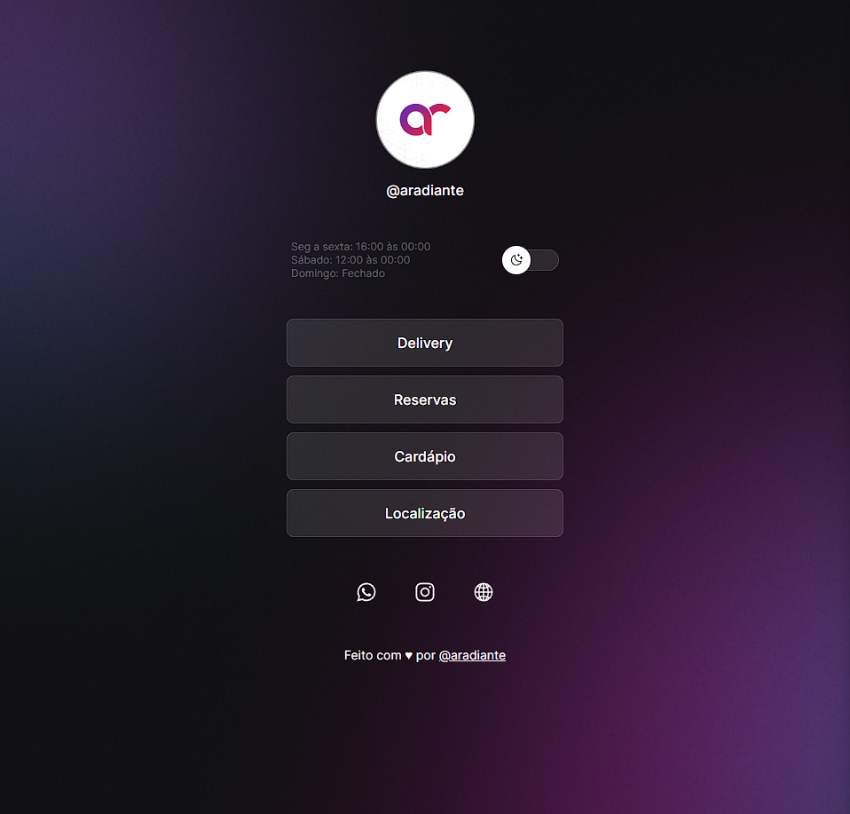

# LinksPage

> Projeto

## Projeto

O LinksPage é um agregador de links para usar como cartão de visitas online.

## 🛠 Tecnologias

Esse projeto foi desenvolvido com as sequintes tecnologias:

- HTML e CSS
- JavaScript
- Git e Github
- Figma

## 💛 Contato

aradiante@outlook.com
@aradiante
